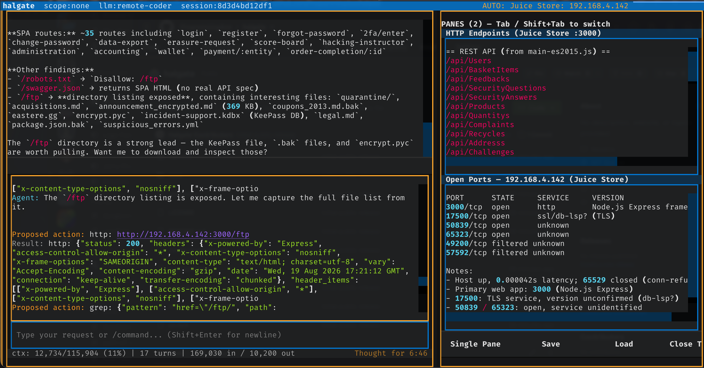

# Halgate

Halgate is a local AI harness for authorized security
research. It combines a terminal UI with target-scoped tools, approval gates,
budgets, audit logs, and encrypted handling of discovered credentials.



## Requirements

- Python 3.12+
- [uv](https://docs.astral.sh/uv/)
- An OpenAI-compatible LLM endpoint

## Install

```sh
uv sync --extra dev
```

Create your local configuration, then set the API key if your endpoint needs
one:

```sh
cp config.example.yaml config.yaml
```

Update `config.yaml` with your local LLM endpoint you control.

To retain encrypted credentials or forensic payloads, initialize a portable
native key and store the displayed recovery phrase offline:

```sh
uv run halgate key init
```

Use `halgate key backup <path>` to export its already-encrypted key envelope.

## Run

```sh
uv run halgate --help
uv run halgate --dry-run
uv run pytest -q
```

## Safety

Use Halgate only against systems you own or for which you have explicit,
written authorization. You are responsible for defining a narrow engagement
scope and complying with applicable law, contracts, and organizational policy.

Do not use it to access, disrupt, or probe systems without permission, or to
handle credentials or personal data beyond what an authorized engagement
requires. Tool execution is constrained by engagement scope, package
permissions, operator approval, and resource budgets, but these controls do
not replace professional judgment. Review the configuration and proposed
actions before every engagement.

## License

MIT. See [LICENSE](LICENSE).
